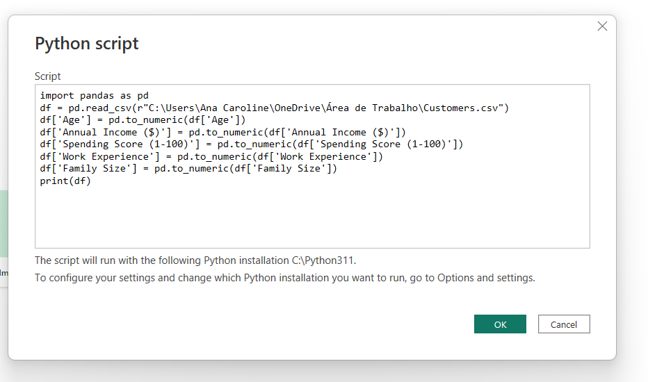
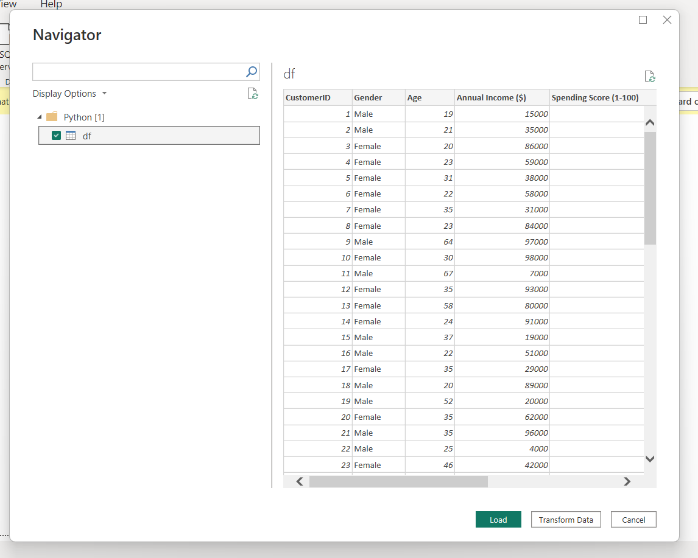
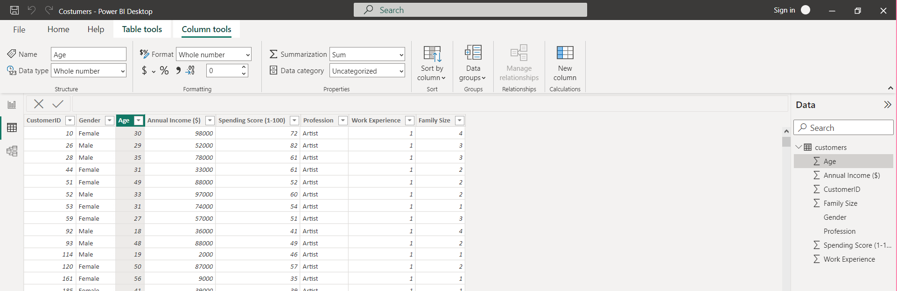
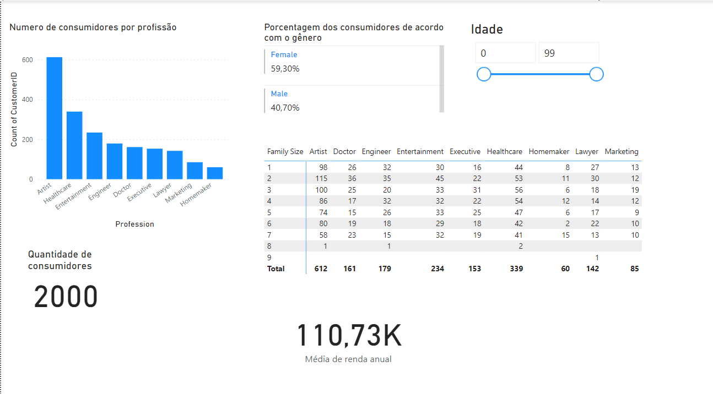

# Exercício Power Bi e Pandas

### Inicialmente buscar a fonte de dados csv

[Link para a base de dados do exemplo](https://www.kaggle.com/datasets/datascientistanna/customers-dataset?resource=download) https://www.kaggle.com/datasets/datascientistanna/customers-dataset?resource=download

Obs.: Esse dataset de exemplo é apenas imaginativo, não são informações confiaveis, apenas utilizado para testes das plataformas.

### Execução do script Python que será a fonte de dados do Power BI

### Tela do PowerBi após a tela anterior

### Tabela já no banco de dados do  PowerBi, preparada para gerar gráficos e relatórios

### Dashboard final com os dados provenientes da tabela, apenas para exemplificar alguns tipos de vizualizações do PowerBI

